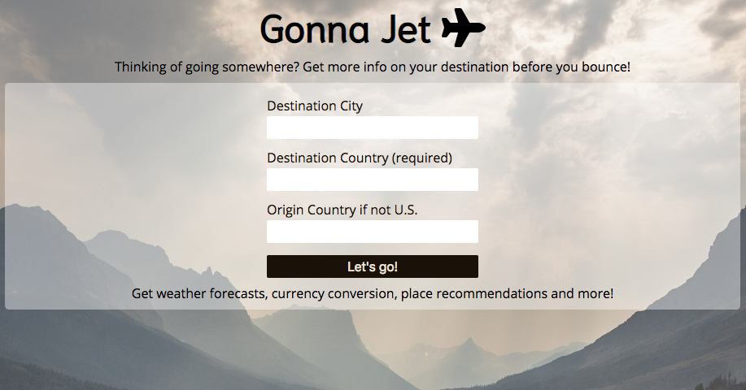
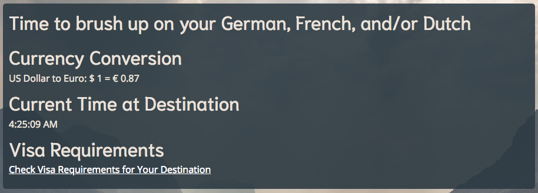
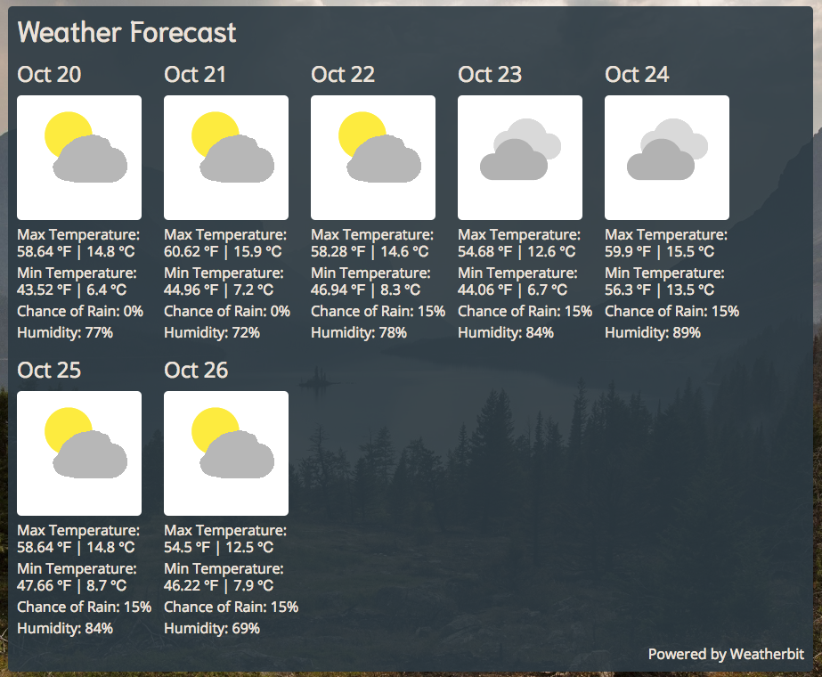
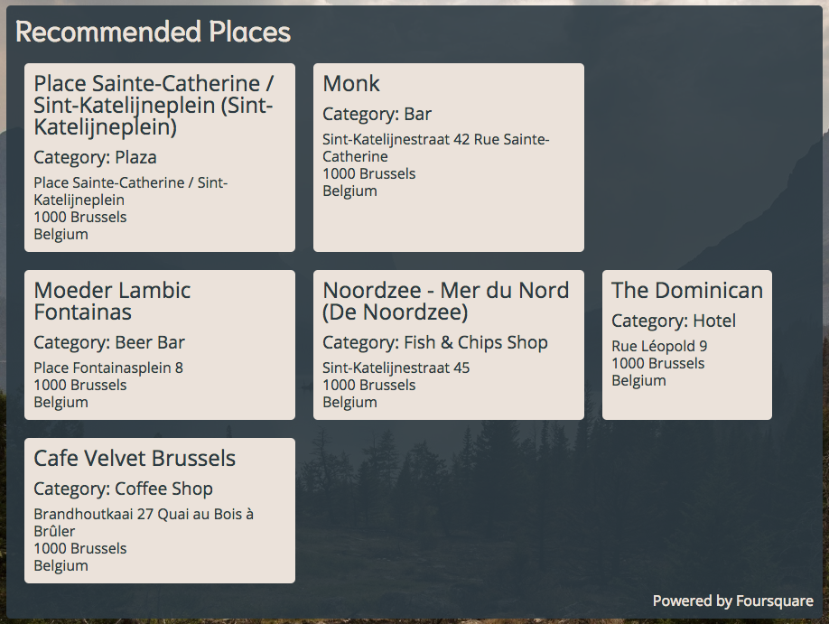
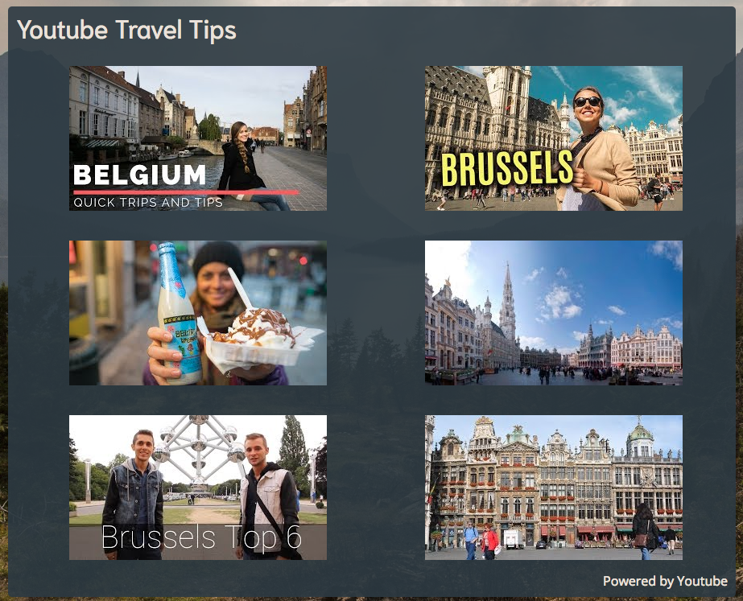

Enter in a destination and get some info to help you plan and prepare!

Test it out at: https://peasofmind.github.io/api-capstone/

##Screenshots
Initial Search Page:

Results:
Recommendations on language(s) to learn, currency conversion, time at destination,
and a link to a website with visa recommendations for the destination country

Weather Forecast Results:
Forecast weather, probability of rain, and humidity for the next 7 days

Recommended Places:
6 places in the destination city or country from different categories recommended
to the user from Foursquare

Youtube Results:
6 search results about travel tips in the destination city or country from Youtube.

##Summary
Gotta Jet seeks to provide useful information for travelers by consolidating 
multiple travel resources in one place.

Built with: HTML, CSS, Javascript, and jQuery
APIs used: Exchangeratesapi, Foursquare, Youtube, locationIQ, and Weatherbit